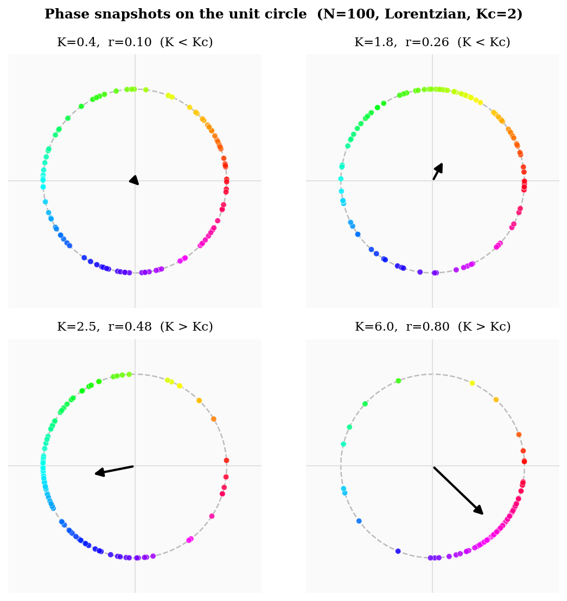
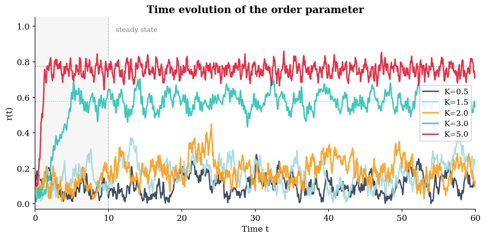
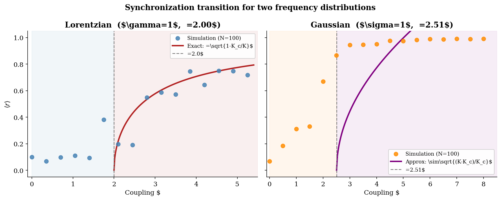
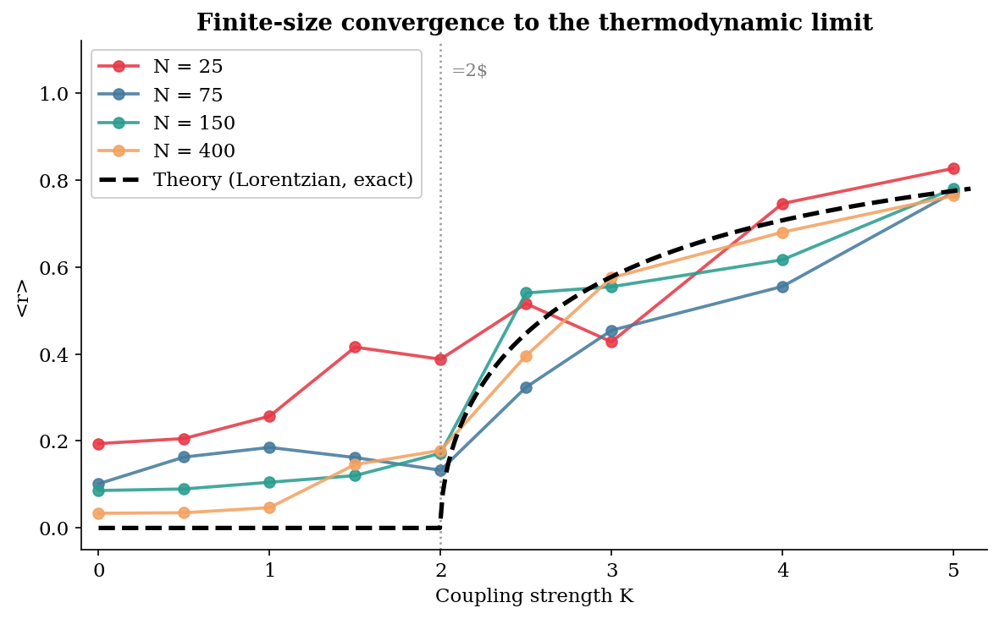

# Kuramoto Model : Synchronization Dynamics

**Course:** Modelling Complex Systems | Module-2
**Institute:** Indian Institute of Science Education and Research, Mohali
**Author:** Avneesh Singh | MS23249
**Date:** March 9, 2026

---

## Overview

This project studies the **all-to-all Kuramoto model** with sine coupling function which is a
paradigm for collective synchronization in complex systems. Each oscillator has its own
natural frequency drawn from a probability distribution, and coupling between oscillators
leads to spontaneous phase locking above a critical coupling strength.

The synchronization transition is characterized analytically using mean-field theory and
verified numerically using a fourth-order Runge-Kutta integrator.

---

## The Model

Each oscillator evolves as:

$$\dot{\theta}_i = \omega_i + \frac{K}{N} \sum_{j=1}^{N} \sin(\theta_j - \theta_i)$$

The **complex order parameter** measures phase coherence:

$$r(t) e^{i\psi(t)} = \frac{1}{N} \sum_{j=1}^{N} e^{i\theta_j(t)}$$

- r = 0 means incoherent (phases uniformly distributed)
- r = 1 means fully synchronized (all phases identical)

**Critical coupling** from mean-field theory:

$$K_c = \frac{2}{\pi g(0)}$$

---

## Frequency Distributions

| Distribution | Parameters | Kc |
|---|---|---|
| Lorentzian | gamma = 1 | 2.00 |
| Gaussian | sigma = 1 | approx 2.51 |

For the Lorentzian, the exact result above Kc is r = sqrt(1 - Kc/K).

---

## Results

### Phase snapshots on the unit circle


### Time evolution of r(t)


### Synchronization transition: Lorentzian vs Gaussian


### Finite-size convergence


---

## Repository Structure
```
kuramoto-model/
├── code/
│   └── kuramoto_sim.py
├── figures/
│   ├── new_fig1_phases.png
│   ├── new_fig2_timeseries.png
│   ├── new_fig3_transition.png
│   └── new_fig4_fsize.png
├── report/
│   └── kuramoto.pdf
├── requirements.txt
└── README.md
```

---

## How to Run

Install dependencies:
```bash
pip install numpy matplotlib
```

Run the simulation:
```bash
python code/kuramoto_sim.py
```

Simulation parameters: N=100 oscillators, dt=0.05, RK4 integration, seed=314.

---

## Key Results

- Continuous (second-order) transition with critical exponent beta = 1/2
- Both Lorentzian and Gaussian distributions show the same qualitative behaviour
- Gaussian gives steeper rise in r above Kc due to lighter tails
- Finite-size effects scale as N^(-1/2) and vanish as N increases

---

## Report

Full report with theory, derivations, and figures: [kuramoto.pdf](report/kuramoto.pdf)

---
